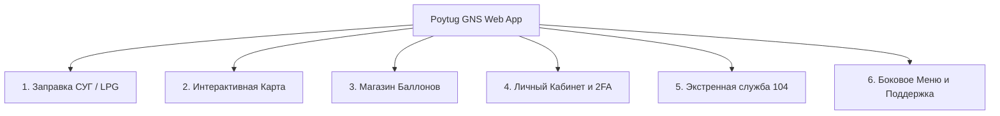

# 🔥 Poytug GNS — Сервис заказа, заправки и экспресс-доставки газовых баллонов (LPG / СУГ)


---

## 📖 1. О проекте: Для чего нужно это приложение?

**«Poytug GNS»** — это современное многофункциональное веб-приложение (Single Page Application, оптимизированное под мобильные устройства и десктоп), предназначенное для полной автоматизации процессов заказа, заправки, покупки и безопасной доставки баллонов сжиженного углеводородного газа (**СУГ / LPG: пропан-бутан**) для частных потребителей (B2C) и корпоративных клиентов (B2B).

### 🎯 Решаемые проблемы:
1. **Исключение необходимости самостоятельной транспортировки:** Клиентам больше не нужно везти тяжелые и потенциально опасные баллоны на заправочные станции.
2. **Прозрачность и контроль качества:** Точный учет объема, веса и давления заправляемого газа.
3. **Безопасность населения:** Интеграция с единой аварийной газовой службой **104** и памятками по технике безопасности при обращении с газом.
4. **Автоматизация оптовых B2B поставок:** Быстрый заказ от 10 баллонов для кафе, ресторанов, теплиц и производств с автоматическим расчетом скидок и формированием Электронных счетов-фактур (Е-Фактура / Soliq.uz).
5. **Экспресс-доставка:** Отслеживание статуса заказа и местоположения курьера на карте в реальном времени со средним временем ожидания до 25 минут.

---

## 🚀 2. Подробный обзор функционала и модулей

Приложение состоит из 5 ключевых функциональных разделов, доступных через нижнюю панель навигации, а также сквозных сервисов:



---

### 1️⃣ Модуль «Заправка СУГ» (Главный экран)
Основной интерактивный сценарий быстрого заказа заправки:

* **Интерактивный реалистичный SVG-баллон и заправочный стенд:**
  * Высокодетализированная 3D-графика баллона с маркировкой, защитным воротником и латунным вентилем ВБ-2.
  * **Анимация подключения:** При нажатии на кнопку **«ЗАПРАВИТЬ»** заправочный пистолет плавно выдвигается и герметично стыкуется со штуцером баллона, светодиодный индикатор переключается на зеленый (*«Шланг подключен ✓»*).
* **Карусель выбора баллонов:**
  * **10 КГ** (Компактный / для дачи и кемпинга) — 45 000 UZS.
  * **20 КГ** (Популярный / для дома и кухни) — 75 000 UZS.
* **Калькулятор количества и B2B Оптовый модуль:**
  * Удобные кнопки `+` / `-` и ручной ввод количества.
  * При выборе **от 10 баллонов** автоматически активируется **Оптовый режим B2B** со специальными скидками до **15%** (например, 20 КГ по 65 000 UZS вместо 75 000 UZS).
* **Продолжение заправки:**
  * После выбора баллона продолжается анимация: в шланге пульсирует неоновый поток газа, баллон плавно заполняется жидким газом от 0% до 100% с динамическими волнами, звуком наполнения и изменением статуса, завершаясь праздничным конфетти.
* **Адрес доставки (Двухэтапный сценарий):**
  * **1. Сохраненные адреса:** Отображает список ранее сохраненных локаций (Дом, Дача и др.) для выбора в один клик. При отсутствии адресов выводится информационный блок с кнопкой добавления.
  * **2. Добавление адреса и Интерактивная карта:** При нажатии кнопки *«Добавить адрес / Указать на карте»* (или при первом заказе) открывается экран с выбором типа локации (🏠 Дом, 🏡 Дача, 🏢 Работа, 📍 Другое), текстовым полем и встроенной картой Leaflet с GPS-геолокацией. При сохранении адрес добавляется в личный список и заказ продолжается.
* **Способы оплаты:**
  * Наличными курьеру при получении;
  * Click Pass / Click.uz (онлайн);
  * Payme (онлайн);
  * Карты Uzcard / Humo;
  * **Перечисление по Е-Фактуре (B2B)** — для юридических лиц с обязательным вводом 9-значного ИНН компании.
* **Экран онлайн-трекинга (Live Tracking):**
  * Таймер ожидания доставки (обратный отсчет 25:00);
  * Интерактивная мини-карта движения курьера;
  * Кнопка прямого звонка курьеру;
  * Электронный фискальный чек с детализацией суммы и позиций заказа.

---

### 2️⃣ Модуль «Интерактивная карта» (Map Screen)
Полнофункциональная карта на базе **Leaflet.js** и тайлов OpenStreetMap / CartoDB:

* **Интерактивные маркеры объектов:**
  * Главная ГНС база / Склады;
  * Пункты обмена баллонов;
  * АГЗС (автогазозаправочные станции).
* **Фильтры по категориям:** мгновенная фильтрация станций на карте («Все», «ГНС Склады», «Пункты обмена», «АГЗС»).
* **Карточка объекта (Bottom Sheet):** Отображает название филиала, точный адрес, статус работы (*«Открыто»*), контактный телефон и кнопку **«Построить маршрут»**.

---

### 3️⃣ Модуль «Магазин оборудования» (Store)
Каталог сертифицированных газовых товаров и аксессуаров:

* **Ассортимент:**
  * Новые стальные газовые баллоны (50л, 20л, 10л);
  * Композитные взрывобезопасные баллоны Ragasco (Норвегия);
  * Газовые редукторы повышенной надежности (GOK, РДСГ);
  * Армированные морозостойкие шланги для СУГ;
  * Газовые счетчики и переходники.
* **Корзина покупок:**
  * Быстрое добавление товаров с выбором количества;
  * Индикатор количества товаров на иконке корзины в шапке;
  * Модальное окно корзины с расчетом итоговой суммы и оформлением заказа.

---

### 4️⃣ Модуль «Личный кабинет и Безопасность» (Account)
Управление профилем и персональными настройками:

* **Профиль пользователя:** отображение имени, номера телефона и текущего статуса.
* **Мой баланс и программа лояльности:** отображение бонусного счета и накопленного кэшбэка (+2% за каждую заправку).
* **2FA Аутентификация (Двухфакторная защита):**
  * Индикатор активной защиты аккаунта (Пароль + SMS OTP);
  * Безопасное хранение пользовательских данных.
* **Привязанные банковские карты:** просмотр привязанных карт (Uzcard, Humo) и модальное окно добавления новой карты.
* **Сохраненные адреса:** список адресов с иконками для быстрого заказа в 1 клик.
* **История заказов:** подробный журнал прошлых заказов с номерами квитанций, датами, суммами и статусами доставки.
* **Настройки интерфейса:**
  * Переключение темы: **Темный режим (Dark Mode)** / **Светлый режим (Light Mode)**;
  * Переключатель звуковых эффектов (Sound FX: заправка, щелчки, уведомления).

---

### 5️⃣ Экстренная служба газа 104 (Emergency Module)
Специальный раздел повышенной безопасности, доступный из любого экрана приложения:

* Кнопка со светящимся индикатором **🚨 104** в шапке приложения.
* **Памятка экстренных действий при запахе газа:**
  1. Немедленно перекрыть вентиль баллона;
  2. Открыть окна для сквозного проветривания;
  3. Не включать и не выключать электроприборы, не зажигать огонь;
  4. Покинуть загазованную зону и вызвать службу газа.
* **Кнопка прямого экстренного звонка в службу 104.**

---

### 6️⃣ Боковое меню (Drawer) и Онлайн-поддержка
* Выдвижное боковое меню с быстрым переходом в баланс, историю, настройки, информацию о компании и службу поддержки.
* **Онлайн-чат поддержки:** интерактивный чат-бот для мгновенных ответов на популярные вопросы о доставке, заправке и стоимости газа.

---

## 🌐 3. Мультиязычность (i18n)

Приложение полностью переведено на 3 языка и поддерживает моментальное переключение в шапке:
* **RU** — Русский язык;
* **UZ** — O'zbek tili (Латиница);
* **EN** — English.

Все системные сообщения, статусы заправки, подсказки и модальные окна динамически адаптируются под выбранную локаль с сохранением выбора в `localStorage`.

---

## 🛠 4. Архитектура и стек технологий

| Компонент | Технология | Описание |
| :--- | :--- | :--- |
| **Frontend Architecture** | **SPA (Single Page Application)** | Быстрая работа без перезагрузок страниц, плавные переходы между экранами |
| **Разметка и каркас** | **HTML5 Semantic** | Доступная семантическая разметка с дата-атрибутами локализации |
| **Стилизация и UI** | **Vanilla CSS3 (Custom Properties)** | Премиальный дизайн Glassmorphism, неоновые акценты, поддержка Dark/Light тем |
| **Логика и анимации** | **Modern JavaScript (ES6+)** | Модульная архитектура, Web Audio API синтезатор звука, управление состояниями |
| **Картография** | **Leaflet.js + OpenStreetMap** | Интерактивная карта станций, геолокация и отслеживание курьера |
| **Иконки и Шрифты** | **FontAwesome 6 + Plus Jakarta Sans** | Современная векторная графика и типографика от Google Fonts |
| **Хранилище данных** | **Web Storage API (localStorage)** | Сохранение сессии, языка, темы, корзины и адресов на клиенте |

---

## 📂 5. Структура файлов проекта

```
PoytugGNS/
├── index.html            # Главный интерфейс приложения со всеми экранами и SVG-графикой
├── index.css             # Полная дизайн-система: стили, переменные, анимации и темы
├── app.js                # Движок приложения: i18n, роутер, аудио, анимации, B2B-логика
├── TZ.md                 # Полное расширенное техническое задание (v3.1)
├── TZ_Template.md        # Шаблон технического задания
└── README.md             # Полная документация проекта
```

---

## ⚡ 6. Инструкция по запуску

Проект не требует сборки и зависимостей Node.js, запускается в любом современном веб-браузере:

1. Склонируйте или откройте папку `PoytugGNS`.
2. Запустите файл `index.html` в браузере (напрямую или через локальный веб-сервер, например **Live Server** в VS Code).
3. **Для тестирования демо-аккаунта:**
   * Телефон: `+998 90 123-45-67`
   * Пароль: `123456`
   * SMS OTP код: `1234`
   * Доступен также быстрый вход в **Гостевом режиме**.

---

## 📄 Лицензия и безопасность
Разработано для обеспечения комфортного, безопасного и прозрачного газоснабжения населения и бизнеса. Все стандарты безопасности соответствуют требованиям транспортировки СУГ.
